# Smart Flammable Material Storage Monitor

### Intelligent Safety & Supervisory System for Flammable Material Storage using ESP32 Dual-Core & FreeRTOS

[](https://www.espressif.com/)
[](https://www.freertos.org/)
[](https://netpie.io/)
[](https://www.arduino.cc/)
[](LICENSE)

---

## Table of Contents

- [Overview & Objectives](#overview--objectives)
- [System Architecture](#system-architecture)
- [Hardware & Circuit Diagram](#hardware--circuit-diagram)
- [FreeRTOS Task Scheduling & Mutex Synchronization](#freertos-task-scheduling--mutex-synchronization)
- [Smart Safety Logic & Fail-Safe Mechanisms](#smart-safety-logic--fail-safe-mechanisms)
- [Cloud Telemetry & NETPIE Dashboard](#cloud-telemetry--netpie-dashboard)
- [Hardware Prototype](#hardware-prototype)
- [Project Directory Structure](#project-directory-structure)
- [Getting Started & Installation](#getting-started--installation)
- [Authors & Acknowledgments](#authors--acknowledgments)

---

## Overview & Objectives

Storage facilities for flammable and hazardous materials (such as Liquefied Petroleum Gas (LPG) tanks, chemical warehouses, or volatile organic solvent rooms) pose severe fire and explosion risks if leaks or ambient overheating go unnoticed.

This project implements an **active, real-time safety supervisory system** powered by the **ESP32 Dual-Core microcontroller** running **FreeRTOS**. By eliminating traditional blocking super-loop polling routines (`vTaskDelete(NULL)` deletes the default Arduino loop), the system guarantees deterministic sensor sampling, microsecond-level safety interlocking, and non-blocking cloud telemetry synchronization.

### Key Objectives:

1. **Real-Time Hazard Surveillance:** Continuously detect flammable gas concentration (LPG via MQ-5), ambient temperature, and relative humidity (DHT22).
2. **Automated Two-Tier Hazard Mitigation:**
   - **Forced Ventilation Mode:** Automatically activate an exhaust ventilation fan upon detecting flammable gas accumulation or excessive moisture.
   - **Cooling Mist Mode:** Activate a water mist cooling pump with hysteresis control when ambient temperatures exceed safe thresholds.
3. **Fail-Safe & Equipment Protection:**
   - **Ignition Spark Prevention:** Instantly cut off water pump relay operation when severe gas leaks occur to eliminate ignition risks from relay contact arcing or motor brushes.
   - **Dry-Run Protection:** Monitor reservoir water levels via waterproof ultrasonic sensing; forcibly disengage the pump if water drops below safe levels to prevent motor burnout.
4. **Cloud IoT Synchronization:** Stream real-time telemetry over MQTT to the **NETPIE 2020 Cloud IoT Platform** with live graphical monitoring.

---

## System Architecture

The firmware utilizes both symmetric cores of the ESP32 (Xtensa dual-core 32-bit LX6 @ 240MHz):

- **Core 1 (Sensor & Control Core):** Deterministic execution of sensor sampling, digital signal filtering (Moving Average), safety interlocking logic evaluation, and hardware actuator driving.
- **Core 0 (Communication & Networking Core):** Asynchronous Wi-Fi state management, NETPIE 2020 MQTT protocol handshakes, and JSON payload serialization/publishing.

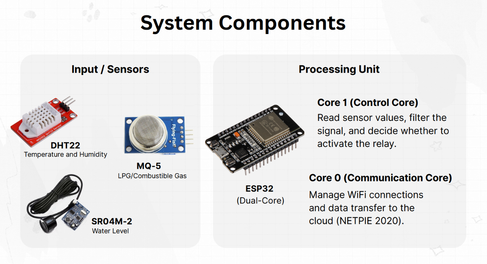

---

## Hardware & Circuit Diagram

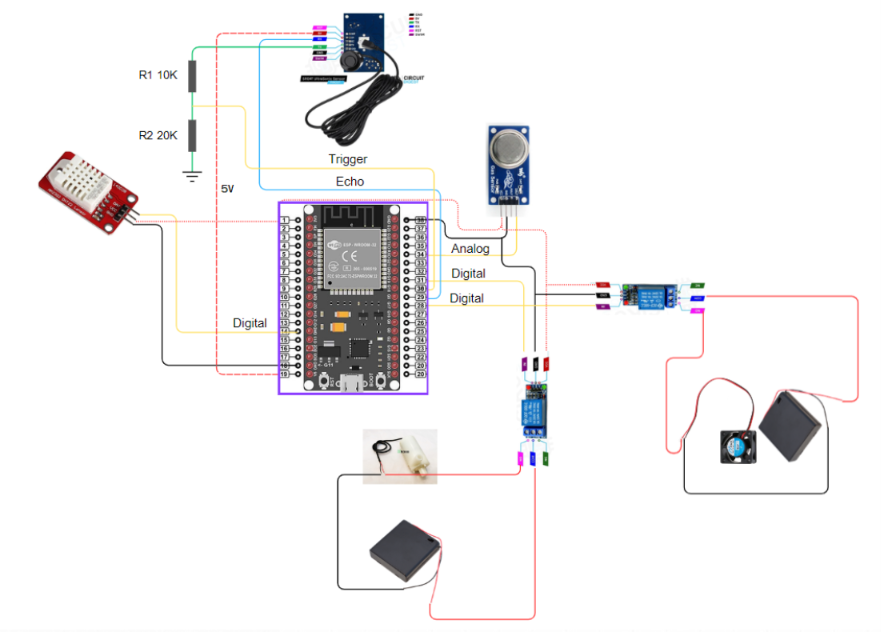

### Pinout & Hardware Interface Table

| Component                             | Model / Part                    | ESP32 Pin (GPIO)                      | Mode / Protocol              | Circuit Notes & Electrical Considerations                                                                     |
| ------------------------------------- | ------------------------------- | ------------------------------------- | ---------------------------- | ------------------------------------------------------------------------------------------------------------- |
| **MCU Board**                         | ESP32 Dev Module (ESP-WROOM-32) | —                                     | —                            | Powered via 5V Micro-USB / VIN rail                                                                           |
| **Temp & Humidity Sensor**            | DHT22 (AM2302)                  | **GPIO 14**                           | Digital (1-Wire)             | 3.3V VCC; sampled every 2.5 seconds                                                                           |
| **Combustible Gas Sensor**            | MQ-5 Gas Module                 | **GPIO 34**                           | Analog (ADC1_CH6)            | 5V VCC (heater coil); analog output connected to ESP32 ADC (0–3.3V range)                                     |
| **Waterproof Ultrasonic Sensor**      | SR04M-2 / JSN-SR04T             | **Trig: GPIO 5**<br>**Echo: GPIO 18** | Digital Pulse I/O            | 5V VCC; Echo pulse reduced from 5V to ~3.3V using a **10kΩ / 20kΩ voltage divider** to protect the ESP32 GPIO |
| **Relay Channel 1 (Water Pump)**      | 2-Channel Relay Module          | **GPIO 19**                           | Digital Output (Active HIGH) | Controls a DC submersible cooling water mist pump                                                             |
| **Relay Channel 2 (Ventilation Fan)** | 2-Channel Relay Module          | **GPIO 17**                           | Digital Output (Active HIGH) | Controls a 12V DC exhaust fan for vapor dissipation                                                           |

> [!NOTE]
> **Echo Pin Voltage Divider Calculation:**
> $$V_{\text{out}} = V_{\text{echo}} \times \frac{R_2}{R_1 + R_2} = 5\text{ V} \times \frac{20\text{ k}\Omega}{10\text{ k}\Omega + 20\text{ k}\Omega} = 3.33\text{ V}$$
> This ensures that the 5V return echo pulse generated by the ultrasonic transceiver safely steps down to match the 3.3V maximum logic level of the ESP32.

---

## FreeRTOS Task Scheduling & Mutex Synchronization

The system employs preemptive FreeRTOS multitasking to guarantee deterministic response to hazardous conditions.

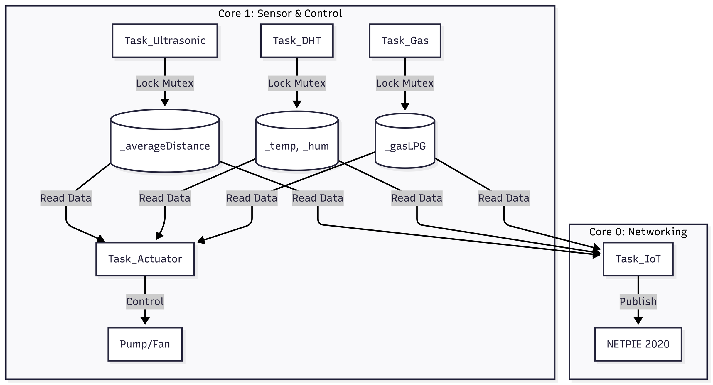

### FreeRTOS Tasks Specification

| Task Identifier   | Assigned Core | Priority        | Execution Interval       | Mutex Used        | Primary Responsibility                                                                                         |
| ----------------- | ------------- | --------------- | ------------------------ | ----------------- | -------------------------------------------------------------------------------------------------------------- |
| `Task_Ultrasonic` | **Core 1**    | 2               | Every 200 ms             | `xMutexDistance`  | Emits 15µs pulse, captures echo, applies a **5-sample Moving Average Filter**, and updates `_averageDistance`. |
| `Task_DHT`        | **Core 1**    | 1               | Every 2,500 ms           | `xMutexTempHum`   | Samples temperature (°C) and relative humidity (%RH); flags communication faults (`isnan`).                    |
| `Task_Gas`        | **Core 1**    | 1               | Every 1,000 ms           | `xMutexGas`       | Performs initial $R_0$ clean-air calibration and calculates LPG concentration in PPM.                          |
| `Task_Actuator`   | **Core 1**    | **3 (Highest)** | Every 500 ms             | Reads all Mutexes | Evaluates multi-condition safety interlocks, manages cooling hysteresis, and drives relay outputs.             |
| `Task_IoT`        | **Core 0**    | 1               | Every 2,000 ms (Publish) | Reads all Mutexes | Maintains Wi-Fi/MQTT connections, formats JSON telemetry, and synchronizes with NETPIE 2020.                   |

### Mutex Semaphores (Race Condition Prevention)

Shared state variables (`_temp`, `_hum`, `_averageDistance`, `_gasLPG`) are updated by sensor producer tasks on Core 1 and read concurrently by consumer tasks on both Core 1 (`Task_Actuator`) and Core 0 (`Task_IoT`).

Binary Mutexes (`xMutexTempHum`, `xMutexDistance`, `xMutexGas`) wrap all read/write accesses via `xSemaphoreTake()` and `xSemaphoreGive()` to prevent memory corruption and race conditions across asymmetric threads.

---

## Smart Safety Logic & Fail-Safe Mechanisms

<details>
<summary>View original slide overview diagram</summary>

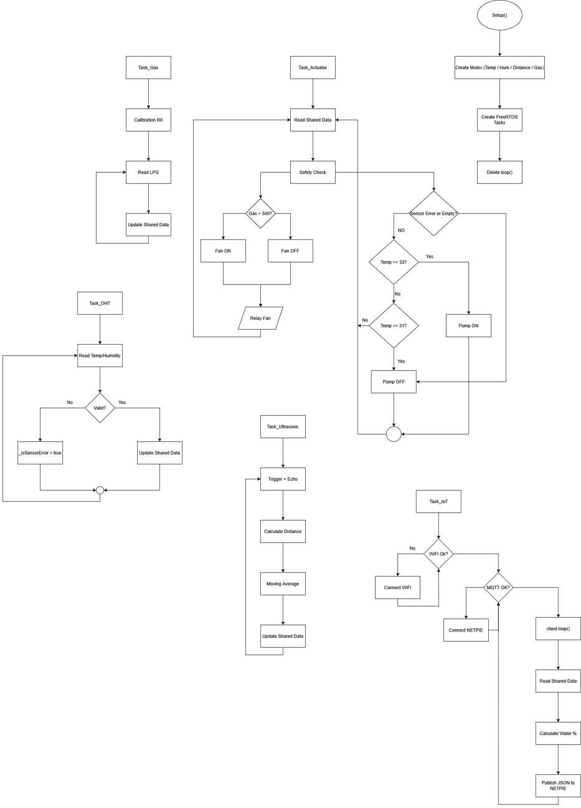

</details>

---

### Task 1 Flowchart: Ultrasonic Water Level & Moving Average Filter

`Task_Ultrasonic` runs on **Core 1** every 200 ms with **Priority 2** to sample reservoir depth and eliminate liquid surface ripple jitter:

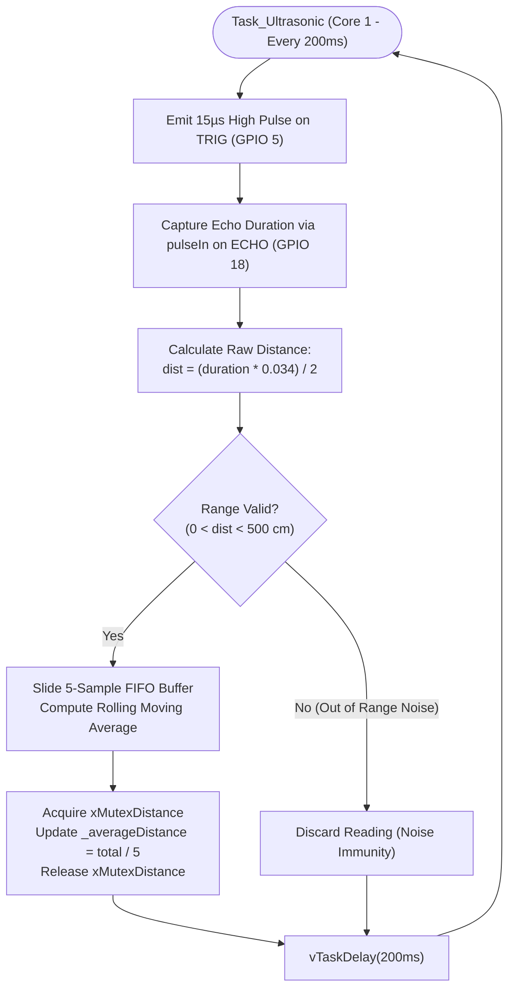

---

### Task 2 Flowchart: Temperature & Humidity Monitoring (DHT22)

`Task_DHT` runs on **Core 1** every 2500 ms with **Priority 1** to measure ambient environmental conditions:

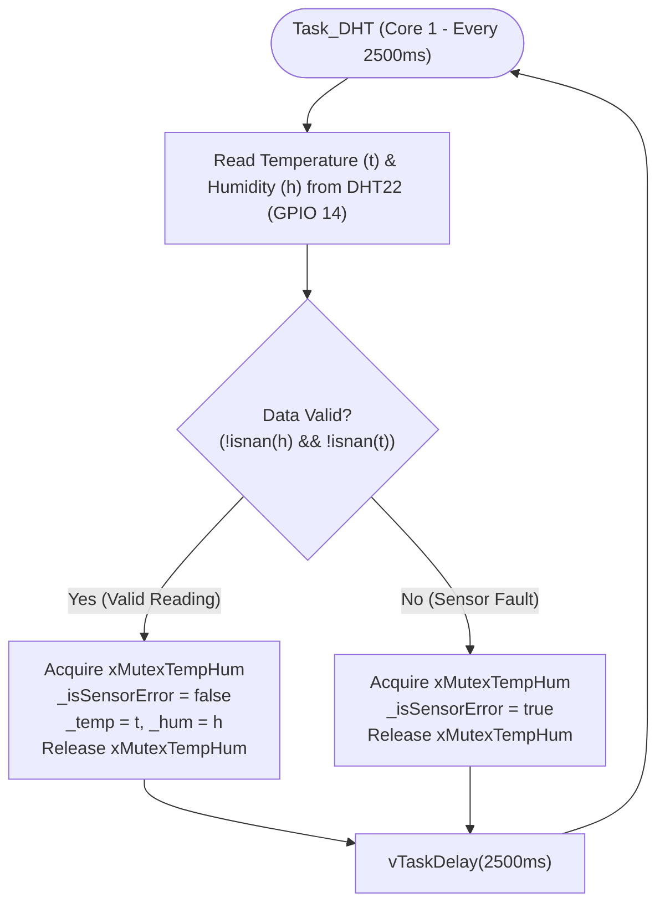

---

### Task 3 Flowchart: Combustible Gas Detection & Calibration (MQ-5)

`Task_Gas` runs on **Core 1** every 1000 ms with **Priority 1** to detect volatile gas leaks:

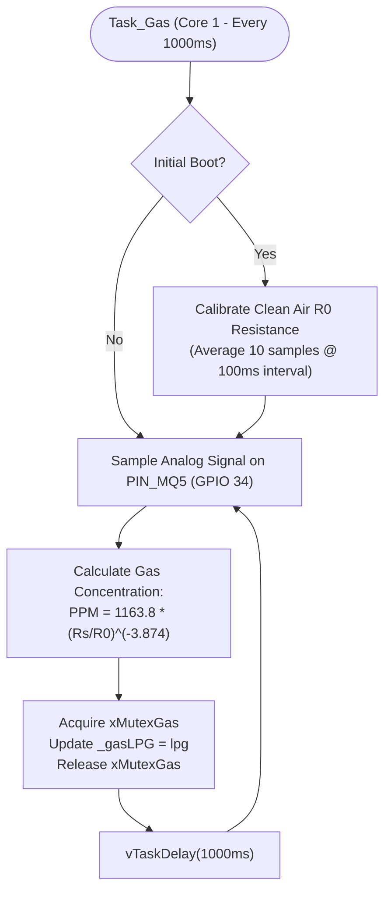

---

### Task 4 Flowchart: Safety Interlocking & Actuator Control

`Task_Actuator` runs on **Core 1** every 500 ms with **Priority 3 (Highest)** to enforce real-time hardware safety decisions:

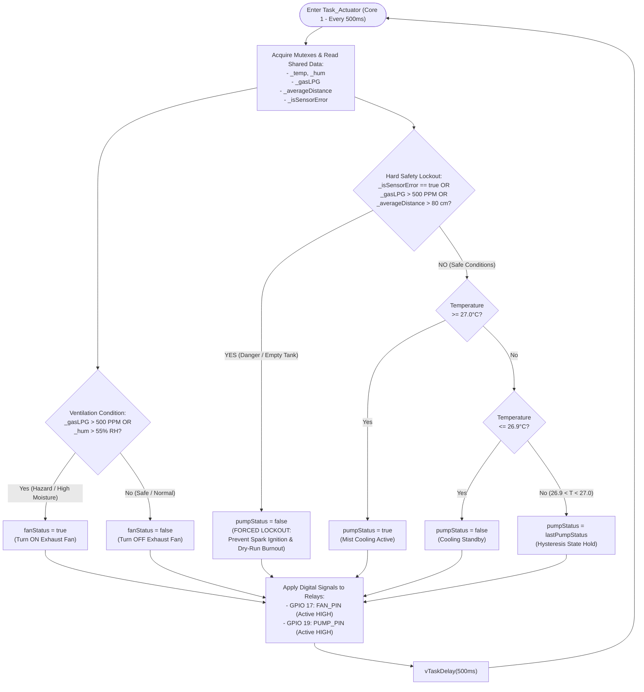

---

### Task 5 Flowchart: Cloud IoT Gateway & NETPIE Telemetry

`Task_IoT` runs on **Core 0** with **Priority 1** to manage network connections and stream sensor telemetry:

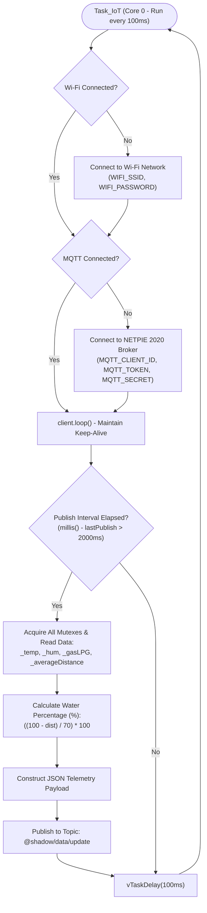

---

### Operational Modes & Safety Summary

### 1. Ventilation Mode (Vapor & Moisture Exhaust)

The ventilation fan engages immediately (`fanStatus = true`) when either condition is met:

- **Gas Hazard Detected:** Combustible gas concentration exceeds threshold ($MQ\text{-}5 > 500\text{ PPM}$).
- **Excessive Humidity:** Ambient relative humidity exceeds $55\%\text{ RH}$.

### 2. Cooling Mode (Misting Suppression with Hysteresis)

Under safe operating conditions, temperature suppression engages automatically:

- **Mist Pump ON:** Triggered when temperature rises to $T \ge 27.0^\circ\text{C}$.
- **Mist Pump OFF:** Disengaged once temperature drops to $T \le 26.9^\circ\text{C}$.
  _(This hysteresis window eliminates rapid relay chattering, extending actuator lifespan.)_

### 3. Safety Interlocks & Emergency Lockouts

The cooling pump is subjected to **hard fail-safe cutoffs (Forced OFF)** regardless of temperature:

- **Gas Leak Hazard ($> 500\text{ PPM}$):** Immediate pump cutoff to prevent electrical sparks from relay contact contacts or motor commutators in an explosive atmosphere.
- **Dry-Run Protection ($> 80\text{ cm}$):** Prevents pump burnout when water in the tank drops below 20% capacity.
- **Sensor Fault Tolerance:** When DHT22 returns invalid data (`isnan`), the system defaults to safe standby.

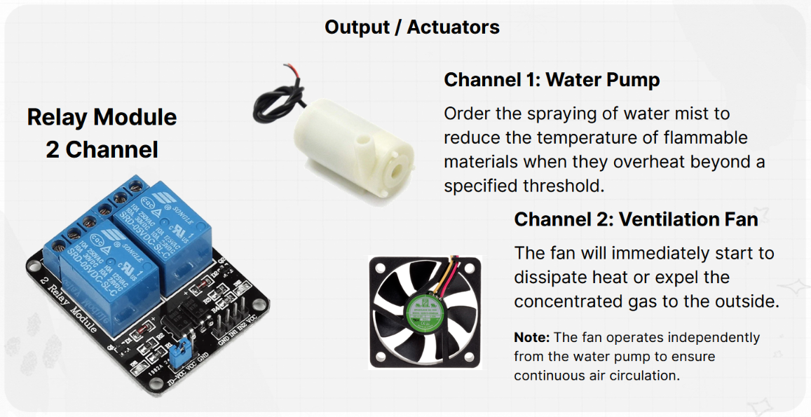

---

## Cloud Telemetry & NETPIE Dashboard

Telemetry data is streamed to **NETPIE 2020** via MQTT on port `1883`:

- **Shadow Update Topic:** `@shadow/data/update`
- **JSON Telemetry Schema:**

```json
{
  "data": {
    "temp": 23.3,
    "hum": 57.3,
    "water_lv": 94.3,
    "dist": 35,
    "gas": 0.0
  }
}
```

### Water Level Volumetric Formula

$$\text{Water Percentage} = \left(\frac{H_{\text{tank}} - D_{\text{measured}}}{H_{\text{tank}} - D_{\text{dead}}}\right) \times 100\%$$

> **Configuration:** $H_{\text{tank}} = 100\text{ cm}$ (tank height), $D_{\text{dead}} = 30\text{ cm}$ (sensor dead zone)

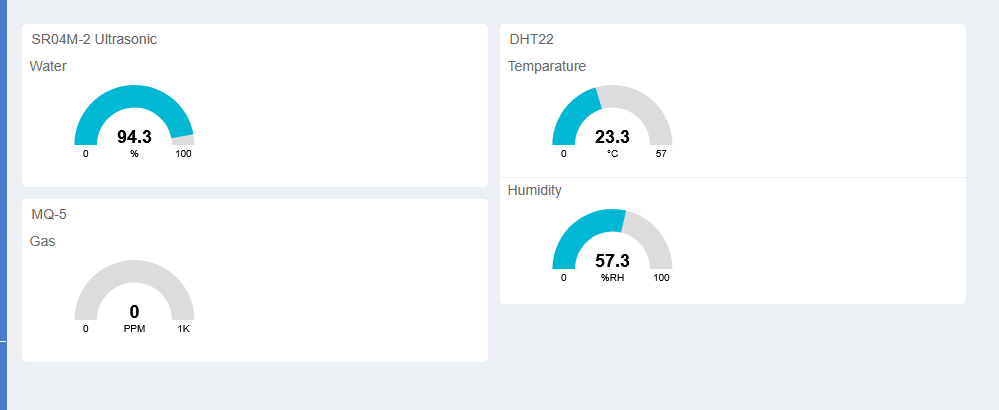

### Diagnostic Serial Monitor Output

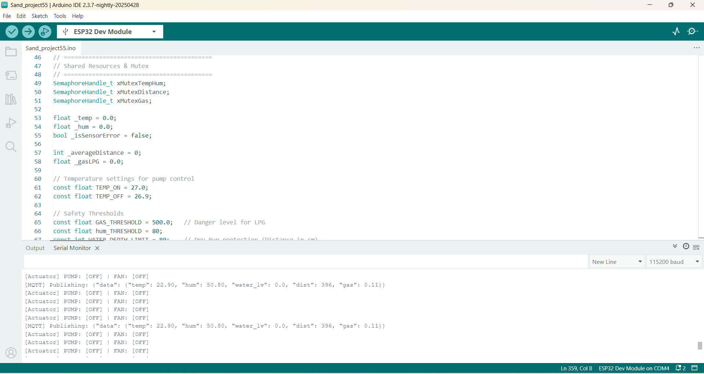

---

## Hardware Prototype

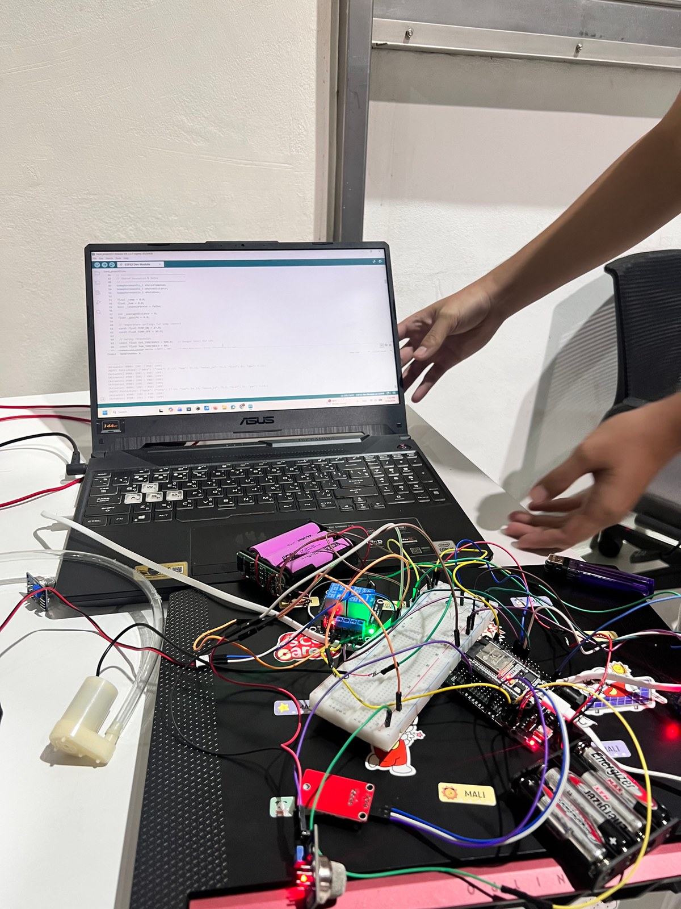

---

## Project Directory Structure

```text
esp32-freertos-iot-safety-system/
├── .gitignore                   # Excludes private config.h, binaries, and build artifacts
├── README.md                    # Comprehensive technical documentation
├── docs/
│   └── images/                  # System diagrams, flowcharts, and photographs
│       ├── actuators_overview.png
│       ├── circuit_schematic.png
│       ├── freertos_task_architecture.png
│       ├── hardware_prototype.jpg
│       ├── netpie_dashboard.png
│       ├── serial_monitor_log.png
│       ├── system_components.png
│       └── system_flowchart.png
└── src/
    ├── config.example.h         # Template configuration for Wi-Fi and NETPIE credentials
    ├── config.h                 # Private credentials file (gitignored)
    └── esp32-freertos-iot-safety-system.ino  # Main FreeRTOS dual-core firmware
```

---

## Getting Started & Installation

### 1. Prerequisites & Toolchain

- [Arduino IDE 2.x](https://www.arduino.cc/en/software) or PlatformIO
- **ESP32 Board Package** by Espressif Systems (v2.0.x or v3.0.x)
- Required Arduino Libraries (available via Library Manager):
  - `PubSubClient` by Nick O'Leary
  - `DHT sensor library` by Adafruit
  - `Adafruit Unified Sensor` by Adafruit
  - `MQUnifiedsensor` by Miguel A. Califa U.

### 2. Configuration Setup

1. Copy the example configuration template to create your local `config.h`:
   ```bash
   cp src/config.example.h src/config.h
   ```
2. Populate `src/config.h` with your Wi-Fi and NETPIE 2020 credentials:

   ```c
   #define WIFI_SSID     "YOUR_WIFI_SSID"
   #define WIFI_PASSWORD "YOUR_WIFI_PASSWORD"

   #define MQTT_BROKER    "mqtt.netpie.io"
   #define MQTT_PORT      1883
   #define MQTT_CLIENT_ID "YOUR_NETPIE_CLIENT_ID"
   #define MQTT_TOKEN     "YOUR_NETPIE_TOKEN"
   #define MQTT_SECRET    "YOUR_NETPIE_SECRET"
   ```

   _(Note: `src/config.h` is automatically ignored by `.gitignore` to prevent credential exposure.)_

### 3. Compilation & Flashing

1. Open `src/esp32-freertos-iot-safety-system.ino` in Arduino IDE.
2. Under **Tools > Board**, select **ESP32 Dev Module**.
3. Set **Upload Speed** to `115200` (or `921600` for faster flashing).
4. Connect the ESP32 via Micro-USB and select the active COM port.
5. Click **Upload**, then open the **Serial Monitor** at **115200 baud** to view real-time diagnostics.

---

## Authors & Acknowledgments

This project was developed as an academic project for **EL454 Embedded Systems** at Bangkok University by:

- **Apisit Suansane** [@kengmaikinpak](https://github.com/kengmaikinpak)
- **Anantachai Mingkhwan** [@Ear-z](https://github.com/Ear-z)
- **Amarin Phola** [@amarinphol-blip](https://github.com/amarinphol-blip)
- **Naparut Kaomoon** [@naparutkaomoon](https://github.com/naparutkaomoon)
- **Thanakirt Kaewkhiaw** [@Tnk2202](https://github.com/Tnk2202)
